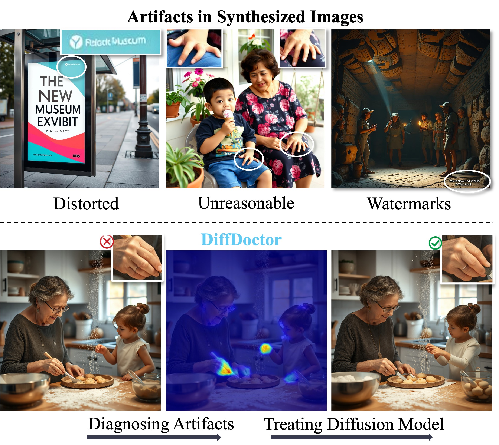

<p align="center">
  <h2 align="center">[ICCV 2025] DiffDoctor: Diagnosing Image Diffusion Models Before Treating</h2>
  <p align="center">
    <a href="https://chandlerwang14.github.io"><strong>Yiyang Wang</strong></a>
    ·
    <a href="https://xavierchen34.github.io/"><strong>Xi Chen</strong></a>
    ·
    <a href="https://xuxiaogang.com"><strong>Xiaogang Xu</strong></a>
    ·
    <a href="https://sihuiji.github.io/Homepage/"><strong>Sihui Ji</strong></a>
    ·
    <a href="https://scholar.google.com/citations?user=8zksQb4AAAAJ&hl=zh-CN"><strong>Yu Liu</strong></a>
    ·
    <a href="https://shenyujun.github.io/"><strong>Yujun Shen</strong></a>
    ·
    <a href="https://hszhao.github.io/"><strong>Hengshuang Zhao</strong></a>
    <br>
    <br>
        <a href="https://arxiv.org/abs/2501.12382"></a>
        <a href='https://chandlerwang14.github.io/DiffDoctor-Page/'></a>
    <br>
    <b>The University of Hong Kong &nbsp; | &nbsp;  Tongyi Lab  | &nbsp;  Ant Financial Services Group | &nbsp; The Chinese University of Hong Kong </b>
  </p>


  <table align="center">
    <tr>
    <td>
      
    </td>
    </tr>
    <tr>
    </tr>
  </table>

## TODOs
* **[DONE✅]** Release the artifact detector checkpoint (in ```checkpoints/```).
* **[DONE✅]** Release the code for training the diffusion model using the artifact detector. 


## Installation
Install with `pip`: 
```bash
pip install -r requirements.txt
```


## Download Checkpoints
- Download the artifact detector checkpoint using ```git lfs``` and put it in ```checkpoints/``` (use ```git lfs install``` to install first, and then use the git commands as usual). If you are not familiar with git lfs, you can directly download it through the download icon (see ISSUE #1).
- Download [Flux.1-Schnell](https://huggingface.co/black-forest-labs/FLUX.1-schnell) or [Flux.1-Dev](https://huggingface.co/black-forest-labs/FLUX.1-dev) checkpoint from HuggingFace.


## Diagnose: Inference on the Artifact Detector
After downloading and placing the checkpoint of the artifact detector, run the following command to use the demo code for the artifact detector.
```bash
python ad_inference.py
```

## Treat: Training the Diffusion Model
Checklist before running the training code:
- Downloading and placing the checkpoint of the artifact detector (```ad_pytorch_model.bin```) into folder ```checkpoints/```.
- Modify config/settings.py. You should change all the checkpoint paths to the backbone diffusion model. All these paths are annotated with "YOUR_PATH/xxx" (e.g., change 'YOUR_PATH/FLUX.1-dev' to 'black-forest-labs/flux.1-dev').
- [*Optional*] Further modify config/settings.py to change the training parameters, the used prompts, etc. For example, you can change config.prompt_fn or config.eval_prompt_fn to any txt file in ```src/prompt_files```.

After preparation, run the following command to train the diffusion model using the artifact detector.
```bash
accelerate launch --config_file config/accelerate_single.yaml train_diffusion_model.py --config config/settings.py:ad 
```

We also include the training code by using feedback from [HPS v2](https://github.com/tgxs002/HPSv2). After downloading the checkpoint ```HPS_v2_compressed.pt``` and modify config.hps_ckpt_path, you can run the training code by:
```bash
accelerate launch --config_file config/accelerate_single.yaml train_diffusion_model.py --config config/settings.py:hps
```


## Acknowledgements
This project is developped on the codebase of [AlignProp](https://github.com/mihirp1998/AlignProp). 
We appreciate this great work! 


## Citation
If you find this codebase useful for your research, please use the following entry.
```BibTeX
@article{wang2025diffdoctor,
  title={DiffDoctor: Diagnosing Image Diffusion Models Before Treating},
  author={Wang, Yiyang and Chen, Xi and Xu, Xiaogang and Ji, Sihui and Liu, Yu and Shen, Yujun and Zhao, Hengshuang},
  journal={ICCV},
  year={2025}
}
```
